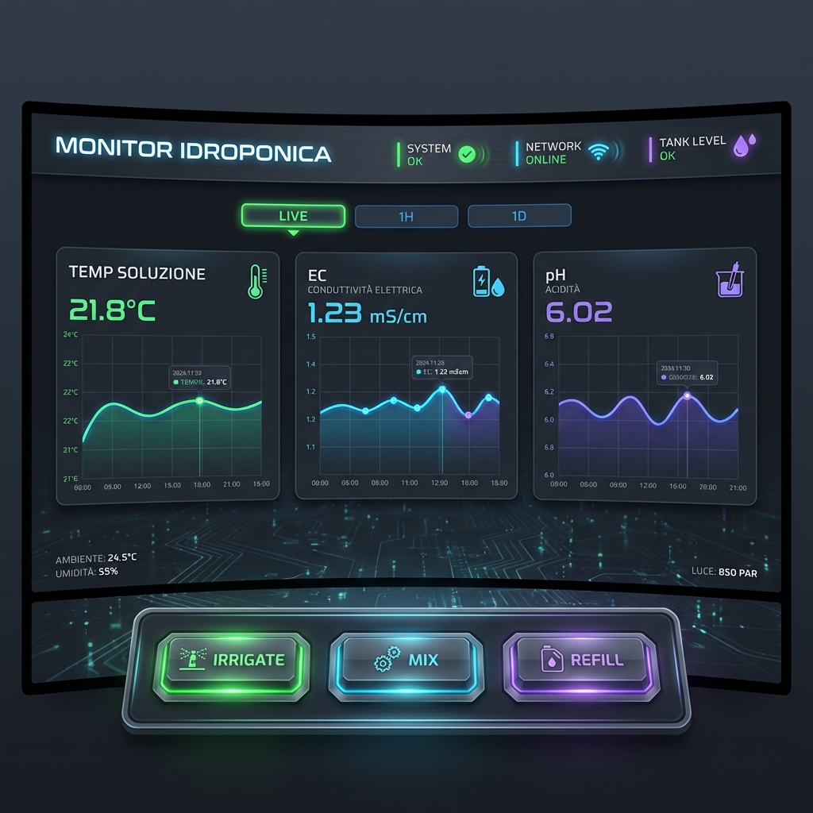
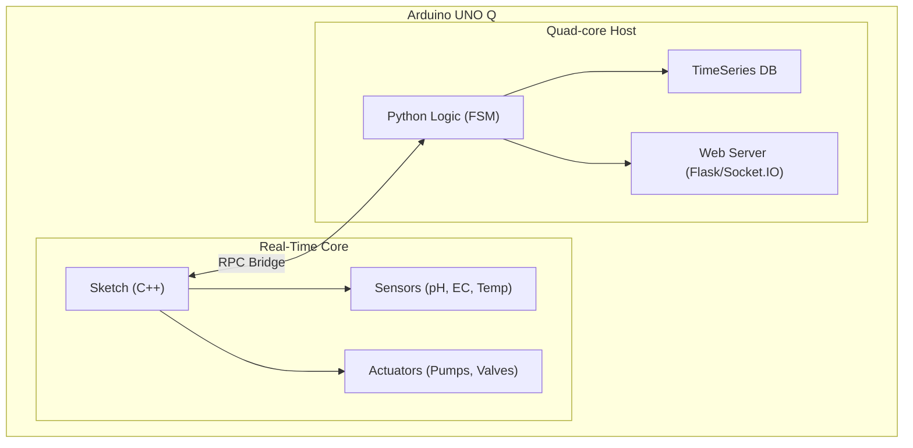

<!--
Licensed to the Apache Software Foundation (ASF) under one or more
contributor license agreements.  See the NOTICE file distributed with
this work for additional information regarding copyright ownership.
The ASF licenses this file to You under the Apache License, Version 2.0
(the "License"); you may not use this file except in compliance with
the License.  You may obtain a copy of the License at

   http://www.apache.org/licenses/LICENSE-2.0

Unless required by applicable law or agreed to in writing, software
distributed under the License is distributed on an "AS IS" BASIS,
WITHOUT WARRANTIES OR CONDITIONS OF ANY KIND, either express or implied.
See the License for the specific language governing permissions and
limitations under the License.
-->

<p align="center">
  
  <br>
  <b>Idroponica for Arduino UNO Q</b>
  <br>
  <a href="https://github.com/arduino/arduino-pro-ide/releases">
    
  </a>
  <a href="https://www.python.org/downloads/">
    
  </a>
  <a href="LICENSE">
    
  </a>
</p>

# MYHydroponic

**MYHydroponic** is a modern, high-performance controller for hydroponic systems running on the dual-processor **Arduino UNO Q**. It seamlessly bridges real-time hardware control with advanced logic and data visualization.

Everything is automated: irrigation, nutrient dosing (pH/EC), levels, and temperature. The system provides a beautiful, real-time web dashboard for monitoring your crops from anywhere.

<p align="center">
  <b>
    <a href="#why-idroponica">Why Idroponica?</a> |
    <a href="#features">Features</a> |
    <a href="#architecture">Architecture</a> |
    <a href="#installation">Installation</a> |
    <a href="#resources">Resources</a>
  </b>
</p>

## Why MYHydroponic?

Hydroponics requires precision. **MYHydroponic** delivers it by leveraging the unique architecture of the Arduino UNO Q. The Real-Time MCU (Cortex-M33) handles the critical timing for pumps and sensors, while the powerful Linux MPU runs the complex logic, database, and web server.



### Key Capabilities

-   **Precision Control**: Real-time management of pumps and solenoids.
-   **Smart Dosing**: Automatic adjustment of pH and EC levels with intelligent cooldowns.
-   **Data-Driven**: Historical data tracking for long-term crop optimization.
-   **Safe**: Integrated fallback mechanisms and safety stops for water levels.

## Features

-   **Dual-Brain Architecture**: Best of both worlds—real-time reliability + Linux power.
-   **FSM Automation**: Robust Finite State Machine handles Filling, Irrigating, Draining, Dosing, and Mixing states.
-   **Advanced Monitoring Service**:
    -   **Water Temperature**: Filtered NTC reading.
    -   **pH & EC**: Industrial-grade sensor support with temperature compensation.
    -   **Water Level**: Digital float switch interrupt handling.
-   **Interactive Dashboard**:
    -   Real-time charts (Chart.js via Socket.IO).
    -   Manual override controls.
    -   System status indicators.

## Architecture

The system uses a **Bridge RPC** mechanism to communicate between the Arduino Sketch and the Python application.



## Installation

### 1. Arduino Firmware

Flash the microcontroller with the hardware driver.

1.  Open `sketch/sketch.ino` in **Arduino IDE 2.0+**.
2.  Install the `Arduino_RouterBridge` library.
3.  Select Board: **Arduino UNO Q**.
4.  Hit **Upload**.

### 2. Python Controller

Deploy the logic to the Linux environment on the board.

```bash
cd python
# Install dependencies
pip install -r requirements.txt

# Start the application
python main.py
```

## Resources

-   **[Hardware Guide](GUIDA_BRIDGE.md)**: Detailed RPC Bridge documentation.
-   **[Arduino UNO Q Docs](https://docs.arduino.cc/hardware/uno-q)**: Official hardware documentation.

## License

This project is licensed under the MIT License - see the LICENSE file for details.
