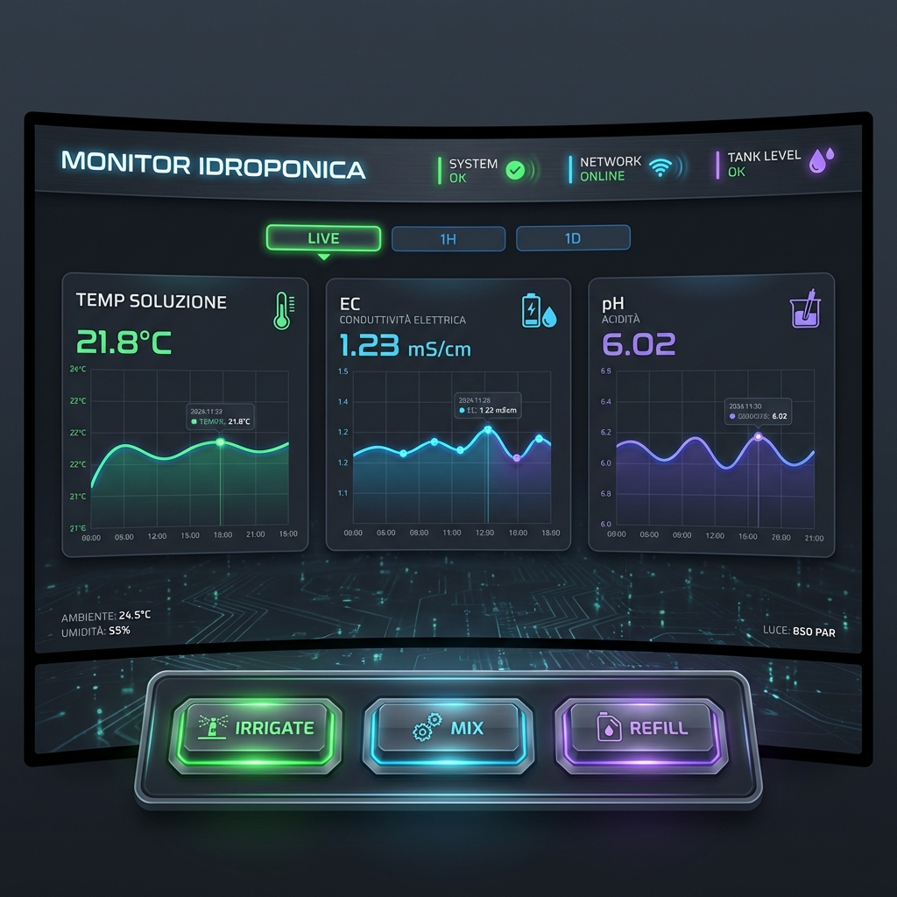
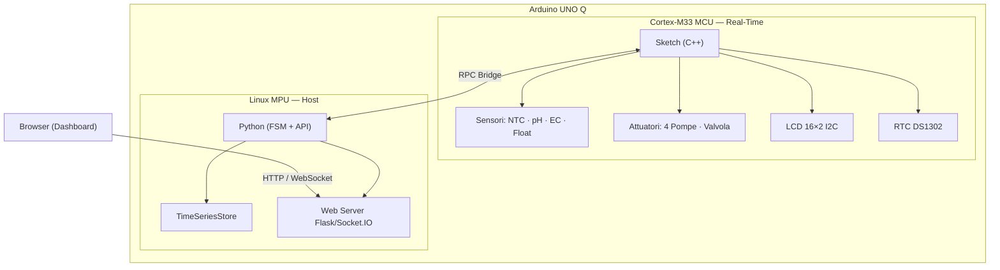

<p align="center">
  
  <h1 align="center">MYHydroponic</h1>
  <p align="center">Controller automatico per sistemi idroponici su <b>Arduino UNO Q</b></p>
</p>

<p align="center">
  <a href="https://docs.arduino.cc/hardware/uno-q">
    
  </a>
  <a href="https://www.python.org/downloads/">
    
  </a>
  
  <a href="LICENSE">
    
  </a>
</p>

---

**MYHydroponic** unisce il controllo hardware real-time del microcontrollore Cortex-M33 dell'Arduino UNO Q con la logica applicativa Python che gira sul processore Linux integrato.

Tutto è automatizzato: **irrigazione schedulata**, **dosaggio pH/EC**, **rabbocco**, **ricircolo** e **monitoraggio sensori**. I dati vengono registrati su un database time-series e visualizzati su una dashboard web real-time.



---

## Sommario

- [Funzionalità](#funzionalità)
- [Architettura](#architettura)
- [Hardware richiesto](#hardware-richiesto)
- [Installazione](#installazione)
- [Configurazione](#configurazione)
- [Licenza](#licenza)

---

## Funzionalità

### FSM a 8 stati

| Stato | Descrizione |
|---|---|
| `IDLE` | Attesa; verifica schedule irrigazione, dosaggio e ricircolo |
| `REFILLING` | Rabbocco vaschetta (timeout 2 min → `ERROR`) |
| `IRRIGATING` | Irrigazione automatica (3 min) |
| `DRAINING` | Attesa scolo prima del ricircolo (5 min) |
| `DOSING` | Attivazione pompa pH-down o nutrienti (10 s) |
| `MIXING` | Ricircolo post-dosaggio per omogeneizzare (5 min) |
| `RECIRCULATING` | Ricircolo orario (2 min) |
| `ERROR` | Stato di blocco (es. timeout rabbocco) |

### Sensori

| Sensore | Pin | Note |
|---|---|---|
| Temperatura (NTC 10k) | `A2` | Filtro esponenziale α=0.1, media mobile 20 campioni, ADC 14 bit |
| pH | `A0` | Tensione in mV → libreria `DFRobot_PH` con compensazione temperatura |
| EC | `A1` | Tensione 0–1.5 V → 0–1.5 mS/cm |
| Livello acqua (float switch) | `13` | `INPUT_PULLUP`, HIGH = OK |

### Attuatori

| Attuatore | Pin | Logica |
|---|---|---|
| Pompa irrigazione | `8` | Attiva bassa |
| Pompa pH-down | `9` | Attiva bassa |
| Pompa nutrienti | `5` | Attiva bassa |
| Pompa ricircolo | `7` | Attiva bassa |
| Valvola rabbocco | `6` | Attiva bassa |

### Altre funzionalità

- **Irrigazione schedulata**: ore `7–13`, `15–19`, `21` — una volta per ora per giorno.
- **Ricircolo orario**: ogni ora al minuto 0 (±30 s).
- **Dosaggio sicuro**: cooldown 15 min, max 20 dosaggi/giorno. Snapshot pH/EC pre e post salvati su DB.
- **LCD 16×2 I2C** (`hd44780`): aggiornato in tempo reale con stato FSM e valori sensori.
- **RTC DS1302**: ora sincronizzata da Python all'avvio tramite RPC.
- **Dashboard web**: grafici storici (Chart.js + Socket.IO), comandi manuali, indicatori di stato.
- **Time-series DB**: tutte le misure e gli stati FSM vengono registrati per analisi storica.

---

## Architettura

Il meccanismo **Bridge RPC** (`Arduino_RouterBridge`) gestisce la comunicazione tra lo sketch C++ e Python.


```mermaid
graph TD
    subgraph "Arduino UNO Q"
        subgraph "Cortex-M33 MCU — Real-Time"
            Sketch["Sketch (C++)"]
            Sensors["Sensori: NTC · pH · EC · Float"]
            Actuators["Attuatori: 4 Pompe · Valvola"]
            LCD["LCD 16×2 I2C"]
            RTC["RTC DS1302"]
            Sketch --> Sensors
            Sketch --> Actuators
            Sketch --> LCD
            Sketch --> RTC
        end

        subgraph "Linux MPU — Host"
            Python["Python (FSM + API)"]
            DB["TimeSeriesStore"]
            WebUI["Web Server Flask/Socket.IO"]
            Python --> DB
            Python --> WebUI
        end

        Sketch <-->|"RPC Bridge"| Python
    end

    Browser["Browser (Dashboard)"] -->|HTTP / WebSocket| WebUI
```

---

## Hardware richiesto

- **Arduino UNO Q**
- Sensore NTC 10k (+ resistenza 10k per partitore)
- Sensore pH analogico (es. DFRobot SEN0161)
- Sensore EC analogico
- Float switch digitale (NC o NO da configurare)
- Display LCD 16×2 con interfaccia I2C (PCF8574 / MCP23008)
- RTC DS1302 (+ cristallo 32.768 kHz e batteria CR2032)
- 4 pompe peristaltiche / mini-pompe (pH-down, nutrienti, ricircolo, irrigazione)
- 1 elettrovalvola 12V (rabbocco)
- Driver relay/MOSFET per gli attuatori

---

## Installazione

### 1. Firmware Arduino

1. Apri `sketch/sketch.ino` in **Arduino IDE 2.0+** con supporto per UNO Q.
2. Installa le librerie richieste (Library Manager):
   - `Arduino_RouterBridge`
   - `hd44780`
   - `ClearDS1302`
3. Seleziona board: **Arduino UNO Q**.
4. Carica lo sketch.

### 2. Controller Python

Il controller Python gira sull'ambiente Linux integrato nell'UNO Q (o su un host esterno collegato alla board).

```bash
cd python

# Avvia il controller
python main.py
```

> **Dipendenze**: le librerie principali (`arduino.app_bricks`, `arduino.app_utils`) sono fornite dall'ambiente Arduino UNO Q. Il file `DFRobot_PH.py` e `time_manager.py` sono inclusi nella cartella `python/`.

---

## Configurazione
```python
# Schedule irrigazione automatica (ore del giorno)
WATERING_HOURS = [7, 8, 9, 10, 11, 12, 13, 15, 16, 17, 18, 19, 21]

# Intervallo lettura sensori
interval = 30  # secondi

# Temporizzazioni FSM
IRRIGATION_SEC      = 180   # 3 min
DRAIN_WAIT_SEC      = 300   # 5 min
DOSING_SEC          = 10    # 10 s
MIXING_SEC          = 300   # 5 min
RECIRCULATION_SEC   = 120   # 2 min
REFILL_TIMEOUT_SEC  = 120   # 2 min (timeout → ERROR)
DOSING_COOLDOWN_SEC = 900   # 15 min
MAX_DOSINGS_PER_DAY = 20    # Limite giornaliero di dosaggi
```
REFILL_TIMEOUT_SEC  = 120   # 2 min (timeout → ERROR)
DOSING_COOLDOWN_SEC = 900   # 15 min

# Soglie dosaggio pH/EC
# pH target: 5.5–6.5 | EC target: 1.0–2.0 mS/cm
```

La calibrazione del sensore pH si gestisce tramite `python/phdata.txt` (creato automaticamente al primo avvio con valori di default).

---

## Risorse

- **[Guida Bridge RPC](GUIDA_BRIDGE.md)** — documentazione del meccanismo di comunicazione MCU↔Python
- **[Documentazione Arduino UNO Q](https://docs.arduino.cc/hardware/uno-q)** — specifiche hardware ufficiali

---

## Licenza

Distribuito sotto licenza **MIT** — vedi [LICENSE](LICENSE) per i dettagli.

Copyright © 2026 Walter Mauti
